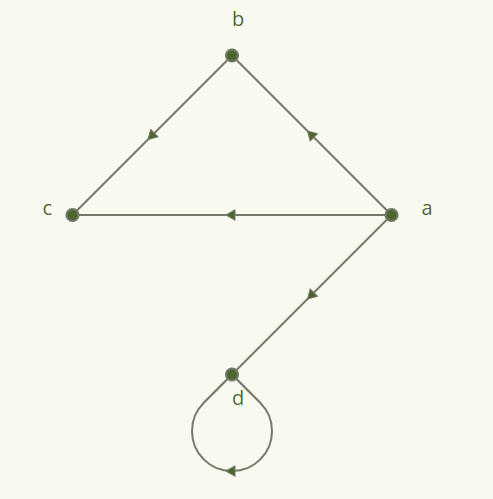
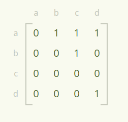
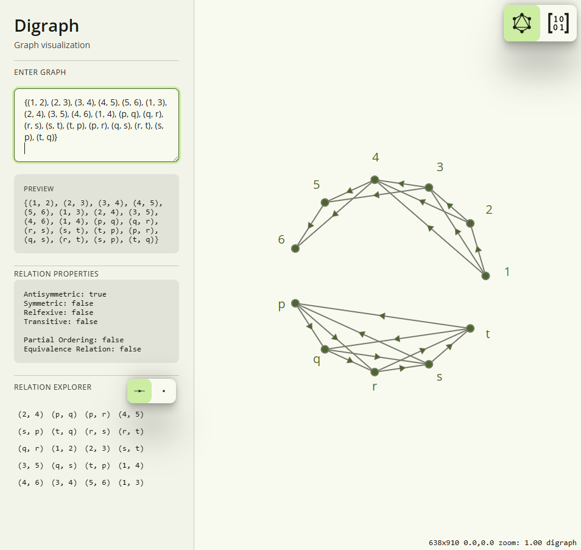

# Digrapher
Digrapher is a discrete math toolchain that helps users visualize concepts like relations, matricies, and other data strucutes.

The term *digraph* refers to [directed graphs](https://en.wikipedia.org/wiki/Directed_graph):
>In mathematics, and more specifically in graph theory, a directed graph (or digraph) is a graph that is made up of a set of vertices connected by directed edges, often called arcs.

## Key Features
- Visualize relations on sets with digraph diagrams
- Inspect relations in matrix view
- View tree structures
- Build relations

## Deploy Locally
Digrapher can be deployed locally through a Docker Virtual Machine
1. Install [Docker](https://www.docker.com/)
2. Run `docker run -p 8080:80 zanelindquist/digrapher`
3. Navigate to [localhost:8080](localhost:8080)

## Contributing
Contributions are gladly appreciated! Please view [current issues](https://github.com/zanelindquist/digrapher/issues), or feel free to [create a new issue](https://github.com/zanelindquist/digrapher/issues/new/choose)!

For more information, refer to [CONTRIBUTING.md](CONTRIBUTING.md)

## Tech Stack
- **Rust** utilizing **Yew**, which builds the app into **WASM**
- **Docker Container** to serve the application locally