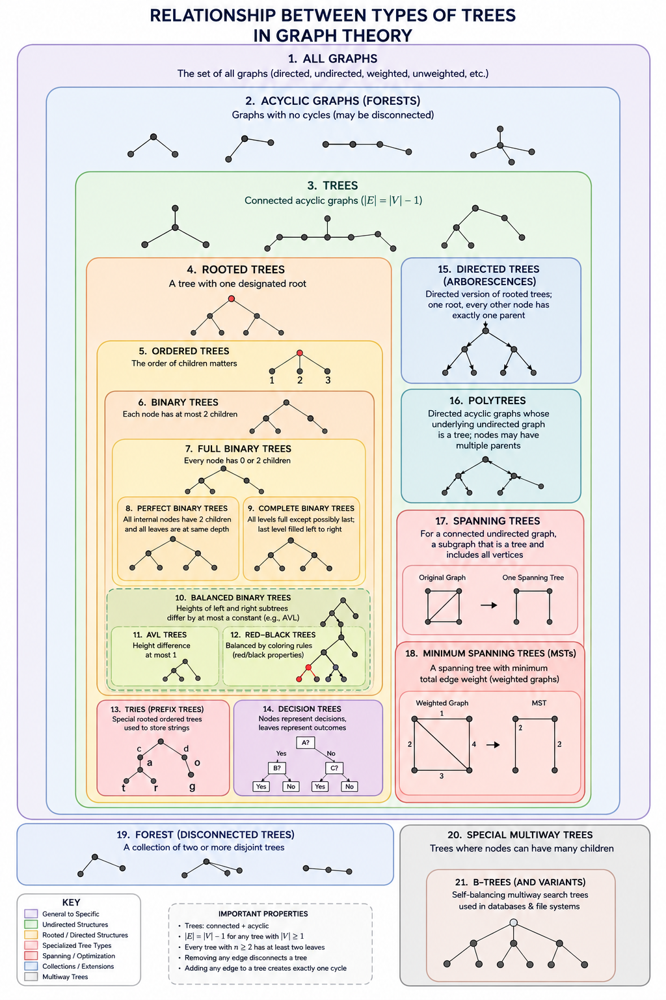

# Positioning Digraph Points Based on Relationships

## Steps
1. Diagnose the type of relationship
2. Identify key points in the relationship
3. Create a general position for the specific type of relationship
4. Move the points around to visually optimize the relationship

## Considerations
Many types of graphs, such as trees, are considered undirected graphs. Currently, this part of the project is for directed graphs, so when analyzing traditionally undirected structures, direction *will* be taken into account. Therefore, for best results, **each graph should be antisymmetric and antireflexive**.

## Pipeline
| Mutation | Output data type | Purpose |
| -------- | ---------------- | ------- |
| Input | text | Start |
| `digest_values()` | `Relation` | Turn the raw input into a relation |
| `process_relation()` | `GraphTheoryRelationManager` | Identify the structure of a relationship and create the node structure |
| `GTM.position_points()` | N/A | Use positioning algorithm to position the points based on the type of graph |
| `GTM.get_points()` | `PointVector` | Get the points to pass to the visual renderer for drawing |
| `<DigraphCanvas/>` | `Html` | Display the processed points |

## Modifications to Existing Program
- Put the point processing logic inside of `<Graph/>` and just pass the points to `<DigraphCanvas/>`

## Key Utilities

### Data Types
- Supported types of special layouts based on the type of relation
    ```rust
    pub enum GraphTheoryTypes {COMPOUND, TREE, CIRCULAR, CLIQUE, NETWORK, LAYERED_NETWORK, CHAIN}
    pub enum NodeType {ROOT, NORMAL, END, CIRCLE_ROOT}
    pub type NodeId: i64

- Serves as an interface to correctly position one or more GraphTheoryRelation. Serves as a bridge between logical and visual to correctly position points.
    ```rust
    pub struct GraphTheoryRelationManager {
        pub relations: Vec<GraphTheoryRelation>,
        pub cached_points: Option<Vec<Points>>
    }
    impl {
        pub fn get_points(&self) -> PointVector {
            if Some(points) = cached_points {
                return points
            };
            let mut points: Vec<Points> = vec![];
            for relation in self.relations {
                points.append(relation.nodes.map(|n| n.point));
            }
            points
        }
        pub fn clear_points_cache(&self) {
            self.cached_points.clear();
        }
        // Mutate and save these points to the points cache
        pub fn position_points(&self) {

        }
    }

- Bundles all of the logical and visual components surrounding rendering a graph
    ```rust
    pub struct GraphTheoryRelation {
        pub relation_type: GraphTheoryTypes,
        pub nodes: Vec<Node>
    }
    impl {
        pub fn get_from_id(&self, i: NodeId) -> &Node {
            return &self.nodes.get(i);
        }
        pub fn get_nodes_of_type_cached()
    }

- Tracks structured information related to each individual node. Node is the logical wrapper around the more visual `Point` struct
    ```rust
    pub struct Node {
        pub id: i64,
        pub node_type: NodeType,
        pub point: Point,
        pub parent: Option<NodeId>,
        pub children: Vec<NodeId>,
        pub depth: i32
    }
- We want to cache nodes so we don't have to sort through them each time we want to get certain nodes
    ```rust
    pub struct CachedNodes {
        nodes: Vec<NodeId>
    }
    impl {
        pub fn clear_cache(&self) -> bool {
            self.nodes.clear();
        }
        pub fn add_cache(&self, id: NodeId) -> bool {
            self.nodes.push(id);
        }
    }

### Functions
- `is_cyclic(graph: &GraphTheoryRelation) -> bool` determines if a graph is cyclic
- `is_chain(graph: &GraphTheoryRelation) -> bool` determines if each node only has one parent and one child (except for the `ROOT` and `END`)
- `is_connected(graph: &GraphTheoryRelation) -> bool` determines if a graph is connected
- `partition_disconnected_relation(graph: &GraphTheoryRelation) -> Vec<GraphTheoryRelation>` breaks up a `COMPOUND` graph into its subparts

## 1. Relation Classification

### Key terms
- *Connected*: there is a possible path between any two nodes
- *Cyclic*: relations can trace back to a start point
    - Deduced using a depth-first-search
        ```bash
        DFS(v) =
        if finished(v): return
        if visited(v):
            "Cycle found"
            return
        visited(v) = true
        for every neighbour w: DFS(w)
        finished(v) = true
        ```
- *Acyclic*: a relation that has no cycles

### Types of relations
- `Compound` -- contains two independent relationships that don't touch each other
- `Clique` -- every point connects to every other point
- `Network` -- 
- `Chain` -- acyclic relationship where every point only one child, spare `ROOT` and `END`
- `Layered Network` -- One or more root points where points in one layer only connect to points in another layer
    - **Criteria**
        - Distinguished from a tree because nodes may have more than one parent, but only from the layer directly above them
    - **Subtypes**
        - `Uniform Layered Network` -- Each layer except the first and last have the same number of points
- `Circular` -- points are arranged in a loop
    - **Criteria**
        - Every point only points to one more point, excluding `(a, a)`
        - Track from a back to a in n - #reflexive steps
    - **Subtypes**
- `Tree` -- many types of graphs
    - **Criteria** (given relation G)
        - G is connected and acyclic
        - G becomes disconnected if any edge is removed from G
        - G has n - 1 edges
    - **Subtypes**
        - `Forest` -- a compound relation whose independent parts are exclusively trees
        - `Rooted Tree` -- a tree where there is one root node
        - `Binary Tree` -- a tree where each node has at most two children
        - `Spanning Tree` -- a minimal, cyclic tree that is used to remove redundancy from path network routes
        - `Polytree` -- the resulting rooted tree when relationship direction is ignored
    - 

## 2. Key Point Identification
### Roots
For any relationship, we can find roots by seeing which points are not being pointed to.

### End Nodes
For any relationship, we can find end points by seeing which nodes do not point to others.

## 3. Point Schematics

### `Rooted Tree`
1. Find initial scaling factors by looping through the points
    - `max_depth` find the total height of the tree
    - `layer_map` create a map of how many points are in each layer
    - `max_width` find the maximum number of points contained by a single layer
2. Define visual rendering variables
    - `layer_height` how many logical units we want per layer
3. Draw the tree to take up a minimal amount of space
    1. Position the root element
    2. For each child recursively
        1. Calculate the angle of the edge
            $$
            \theta = i * \frac{\pi}{n + 1}
            $$
        2. Draw the point
        3. Draw the label

### `Circular`
1. Select the alphabetically first element as the `CIRCLE_ROOT`
2. Track the index of going around the circle
3. Draw each child element as the next around the circle, and draw reflexive relationships
4. Path closes when the `CIRCLE_ROOT` element is reached again

## 4. Point Movement Algorithm
After we have set a point layout, in some circumstances we want to arrange the points so that the relation lines cross the fewest amount, in others, we just want to display them alphabetically