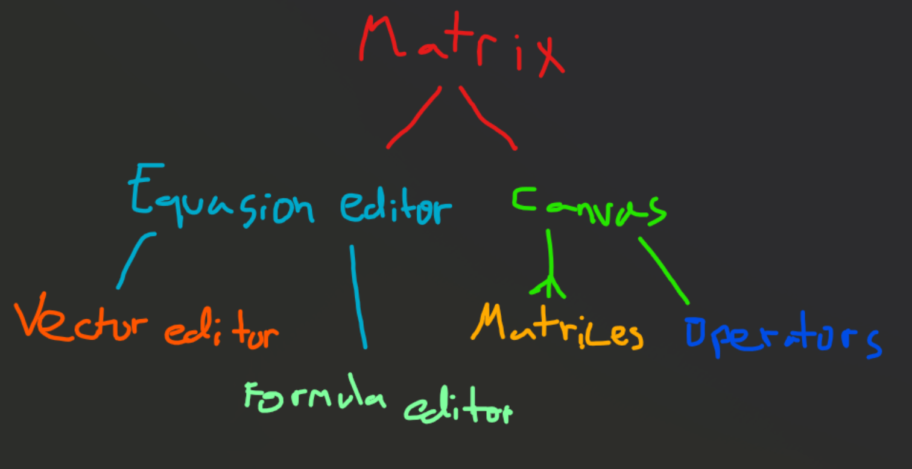

# Matrix Calculator

This feature will add the basic necessities for a functioning matrix calculator. It will let users do operations like multiplication, addition, subtraction, and boolean operations.

## UI Structure

## Logical Operations