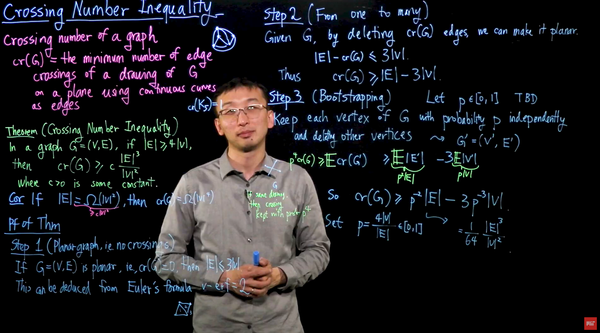

# Network Layout

## Is it possible?
### Check if it is possible to draw a planar graph
- No.
- K5 and K3,3 always cross
- However, many graphs can always be drawn with no crosses
- Instead we may want to find the minimum number of crosses
## Crossing Number Inequality Theorem 

$$
G = (V, E), if |E| >= 4*|V|
$$
then
$$
cr(G) >= C * \frac{|E|^3}{|V|^2} 
$$
where C is some constant

## Best Approaches
- This problem is NP-hard meaning there is no algorithm for solving this problem, so that rules out a one-shot algorithm that gives the lowest number of edge crossings every time.
- The Fruchterman-Reingold algorithm models forces to between nodes and edges for the graph to find a lower number of crossings in an aestetic way.
- Additionally, the [Laplacian matrix](https://www.youtube.com/watch?v=-mPkP3qh-DI) helps model relation connectivity

## Proposed Solution
1. Use a Laplace matrix to create the rough positioning for the points and edges in a slice
2. Run a couple dozen iterations of the Fruchterman-Reingold algorithm so that points find their equilibrium
3. Set and record the positions so that we don't have to do the same thing every time the relation changes

## Playground Solution
1. Find the 3 or 4 points with the most connections
2. Do a BFS from every point and for each point calculate the minimum distance to one of the trifecta points
3. Arrange the trifecta on the outside, and each layer goes farther in

